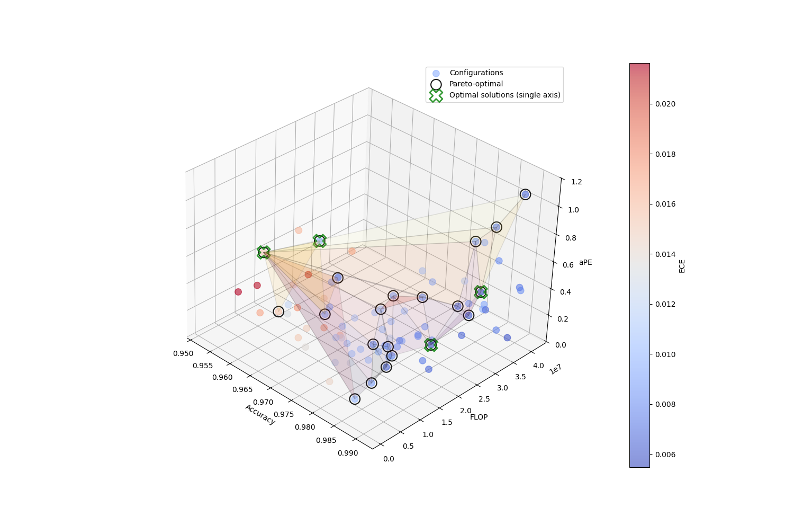

# 4D Pareto Front Plot




```
python plot.py bayes_opt.csv --top 2
```

- reads CSV, considers the last 2 pareto points at each dimension
- to parameterise, edit plot.py in the parameterization section


